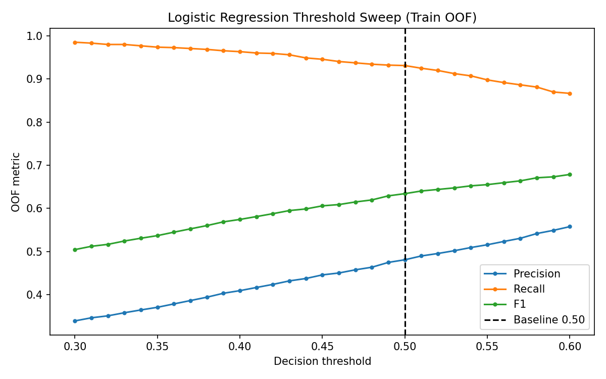

# 신용 위험 모델링 파이프라인

10,000건의 재현 가능한 가상 금융 데이터를 사용해, 규칙 기반 분류와 로지스틱 회귀·랜덤 포레스트, 그리고 리지·라쏘 회귀를 비교하는 지도학습 포트폴리오 프로젝트입니다.

## 범위

분류 모델은 연체 위험의 **추가 심사 우선순위**를 탐색하는 예시입니다. 실제 고객을 자동 승인·거절하지 않으며, `predict_proba()`는 보정된 PD가 아닌 모델 추정 위험 점수로 해석합니다. 데이터와 결과는 교육용 가상 환경에 한정됩니다.

## 빠른 시작

Python 3.10 이상이 필요합니다.

```bash
uv sync
uv run python data_gen.py
uv run python train.py
uv run python -m pytest -v
```

`pip` 환경에서는 `pip install -r requirements.txt` 후 같은 명령을 `python`으로 실행할 수 있습니다. `finance_data.csv`와 예측 CSV는 생성 파일이며 Git에서 제외됩니다.

## 평가 대상

- 분류: 여섯 규칙 기반 기준선, 클래스 가중치를 적용한 로지스틱 회귀, 기본·튜닝 랜덤 포레스트
- 회귀: 리지·라쏘의 alpha 민감도와 holdout RMSE·MAE·R²
- 평가: 고정 80:20 학습·테스트 분할, 학습 데이터 내부 5-fold CV, Pipeline 내부 중앙값 대치와 스케일링

연체 비율은 약 12%이므로 Accuracy만으로는 부족합니다. 학습 데이터에만 `class_weight="balanced"`를 적용하고, F1·ROC-AUC·혼동행렬을 함께 확인했습니다. 로지스틱 회귀는 학습 5-fold CV ROC-AUC가 가장 높고 단순하여 기본 모델로 선택했으며, 튜닝 랜덤 포레스트는 비선형 모델의 비교 대상으로 유지합니다.

## 주요 분류 결과

| Model | Accuracy | F1 | ROC-AUC |
| --- | ---: | ---: | ---: |
| Rule Baseline | 0.7725 | 0.4752 | 0.8096 |
| Logistic Regression | 0.8735 | 0.6274 | 0.9505 |
| Random Forest | 0.9095 | 0.5820 | 0.9376 |
| Random Forest (Tuned) | 0.8810 | 0.6316 | 0.9403 |

상세 CV·threshold·hyperparameter 결과는 [model_selection.md](docs/model_selection.md)와 [metrics.json](artifacts/metrics.json)을 참조합니다.

규칙 기반 기준선보다 로지스틱 회귀는 F1을 `0.4752 → 0.6274`, ROC-AUC를 `0.8096 → 0.9505`로 높였습니다. Tuned RF는 F1이 조금 높지만, 모델 선택은 holdout이 아닌 학습 5-fold CV ROC-AUC와 단순성을 기준으로 합니다.


## 주요 회귀 결과

| Model | Selected alpha | RMSE | MAE | R² |
| --- | ---: | ---: | ---: | ---: |
| Ridge | 1.0 | 29.3667 | 23.2739 | 0.8607 |
| Lasso | 0.1 | 29.3599 | 23.2711 | 0.8607 |

Ridge(L2)는 모든 계수를 연속적으로 축소하고, Lasso(L1)는 강한 규제에서 일부 계수를 0으로 만들 수 있습니다. 이 데이터에서는 둘 다 유사한 holdout 성능을 내며, alpha가 커질수록 Lasso 계수가 빠르게 줄어드는 것을 확인할 수 있습니다.


## 모델 해석과 운영 시나리오

Tuned RF의 feature importance는 `annual_income`, `overdue_count_6m`, `debt_ratio` 순으로 높습니다. 이는 가상 데이터의 생성 규칙과 일치하지만, 이 값은 RF의 impurity 기반 중요도이므로 인과관계나 실제 금융 변수의 공정성을 뜻하지 않습니다. 실제 적용 전에는 permutation importance, 공정성, 시간 기준 검증이 추가로 필요합니다.


오탐(FP)은 정상 고객의 추가 심사를 늘리고, 미탐(FN)은 연체 위험을 놓칠 수 있습니다. 운영 임계값은 자동으로 선택하지 않습니다. Logistic Regression의 Train OOF probability만으로 `0.30~0.60`을 sweep한 표와 그래프를 먼저 검토하고, `0.50` baseline과 비용·심사 역량을 비교해 사람이 결정합니다. Holdout 레이블은 threshold 선택에 사용하지 않습니다.



랜덤 포레스트는 200개 트리 이후 CV ROC-AUC 개선이 작아집니다. 하드웨어 의존적인 batch 예측시간은 `metrics.json`의 `benchmark`에 한 번만 기록하며, 실제 단건 서비스 지연시간으로 해석하지 않습니다.


## 프로젝트 구조

```text
data_gen.py                    # 재현 가능한 가상 데이터 생성
train.py                       # 명령줄 실행 진입점
credit_risk/
  data.py                      # 스키마, 검증, 데이터 분할
  preprocessing.py             # 공통 누수 방지 전처리
  classification.py            # 학습, 교차검증, 임계값, 평가
  regression.py                # 규제 회귀 모델 선택
  reporting.py                 # JSON, CSV, 그래프 저장
  workflow.py                  # 실행 흐름 조립
docs/model_selection.md        # 방법론과 실험 선택 근거
artifacts/                     # 커밋된 지표 기록과 설명용 그래프
tests/                         # 동작 중심 회귀 테스트
```

## 재현성 및 산출물

`random_state=42`는 데이터 생성, 분할, 모델 난수를 고정합니다. `artifacts/metrics.json`은 평가·선택 결과와 단일 `benchmark` 구역을 담고, PNG는 각 평가 요구사항의 시각적 근거입니다. 실행 시간은 하드웨어에 따라 달라지므로 단일 예측 지연시간과 비교하지 않습니다.

## 한계

- 가상 데이터로는 실제 신용 의사결정이나 실제 신청자 집단에 대한 주장을 뒷받침할 수 없습니다.
- 확률 보정, 비용 행렬, 심사 역량 제약, 공정성 분석, 시간 기준 검증은 포함하지 않습니다.
- threshold sweep은 Train OOF 결과만 보여주며, 최종 운영 threshold는 비용과 심사 역량을 고려해 사람이 선택해야 합니다.
