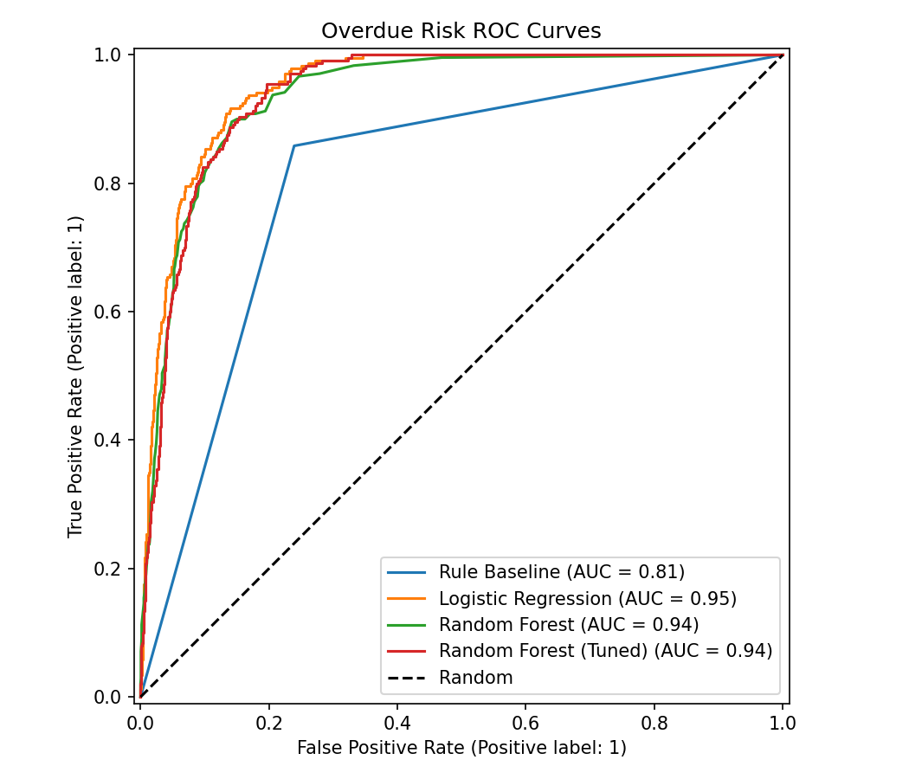
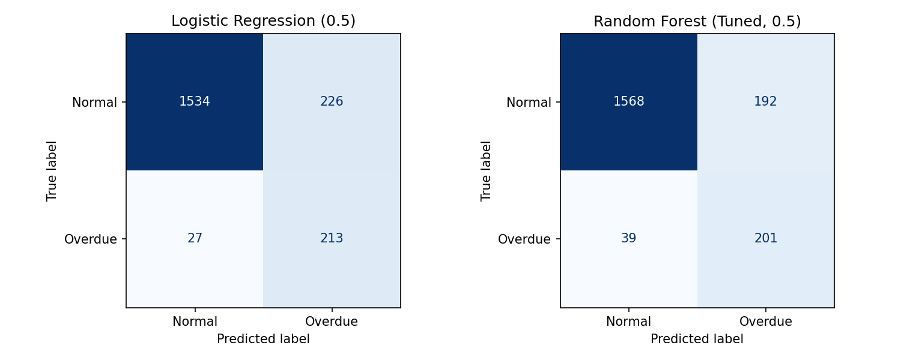
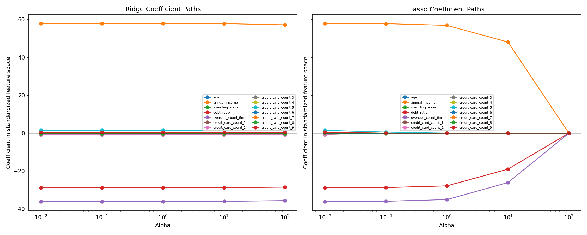
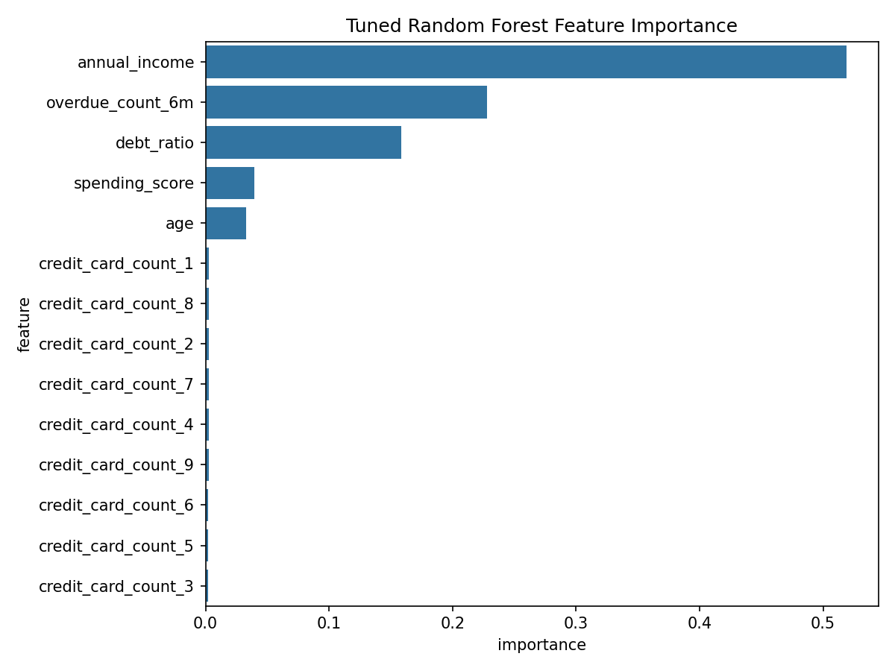
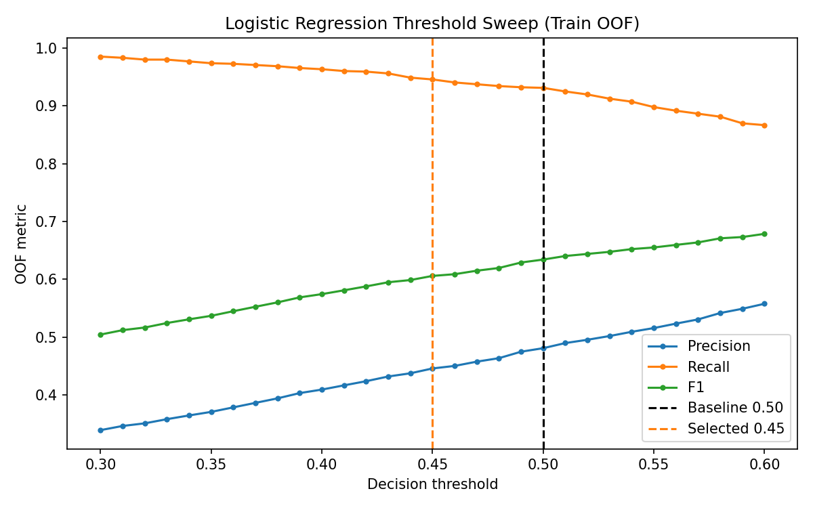
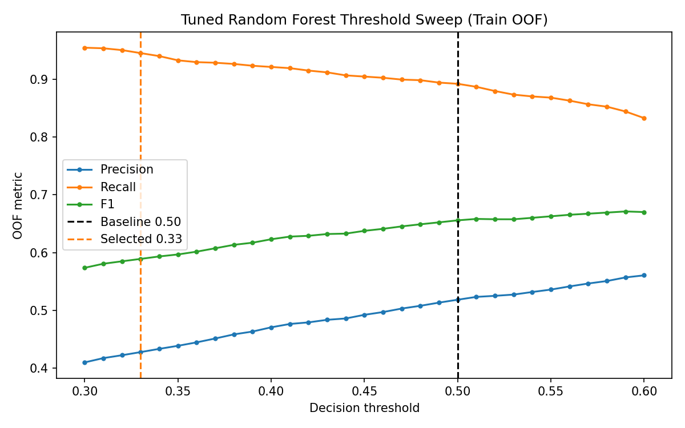
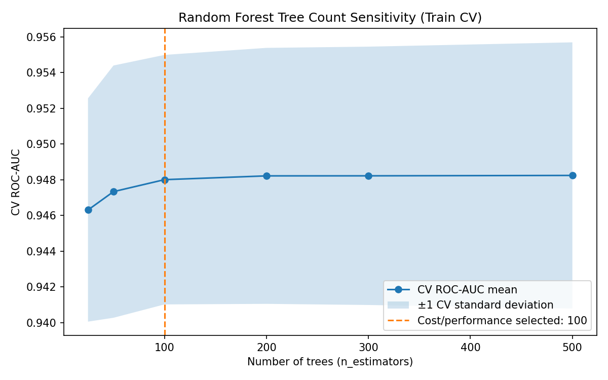

# 신용 위험 모델링 파이프라인

[](https://github.com/shannonlee-dev/credit-risk-modeling-pipeline/actions/workflows/tests.yml)

10,000건의 재현 가능한 가상 금융 데이터를 사용해, 규칙 기반 분류와 로지스틱 회귀·랜덤 포레스트, 그리고 리지·라쏘 회귀를 비교하는 지도학습 포트폴리오 프로젝트입니다.

## 범위

분류 모델은 연체 위험의 **추가 심사 우선순위**를 탐색하는 예시입니다. 실제 고객을 자동 승인·거절하지 않으며, `predict_proba()`는 보정된 PD가 아닌 모델 추정 위험 점수로 해석합니다. 데이터와 결과는 교육용 가상 환경에 한정됩니다.

## 빠른 시작

Python 3.10 이상이 필요합니다.

```bash
uv sync
uv run python scripts/generate_data.py
uv run python train.py experiment
# artifacts/experiment/selection.template.json을 검토·복사해 selection.json을 작성
uv run python train.py final --selection artifacts/experiment/selection.json
uv run python -m pytest -v
```

`pip` 환경에서는 `pip install -r requirements.txt` 후 같은 명령을 `python`으로 실행할 수 있습니다. `data/generated/finance_data.csv`와 예측 CSV는 생성 파일이며 Git에서 제외됩니다.

권장 workflow는 `experiment → human review → final`입니다. `experiment`는 Train-only CV/OOF/sensitivity evidence와 selection template만 만들고, `final`은 검증된 selection으로 Holdout을 한 번만 평가합니다. `python train.py` 또는 `python train.py all`은 승인된 기본 selection을 쓰는 편의 재현 경로입니다. `--profile smoke`는 5-fold 방식은 유지하면서 Logistic C, RF `min_samples_split`, 트리 수 후보만 줄입니다.

## 평가 대상

- 분류: 여섯 규칙 기반 기준선, 클래스 가중치를 적용한 로지스틱 회귀, 기본·튜닝 랜덤 포레스트
- 회귀: 리지·라쏘의 alpha 민감도와 holdout RMSE·MAE·R²
- 평가: 고정 80:20 학습·테스트 분할, 학습 데이터 내부 5-fold CV, Pipeline 내부 중앙값 대치와 스케일링

연체 비율은 약 12%이므로 Accuracy만으로는 부족합니다. 학습 데이터에만 `class_weight="balanced"`를 적용하고, F1·ROC-AUC·혼동행렬을 함께 확인했습니다. 로지스틱 회귀는 학습 5-fold CV ROC-AUC가 가장 높고 단순하여 기본 모델로 선택했으며, 튜닝 랜덤 포레스트는 비선형 모델의 비교 대상으로 유지합니다.

## 주요 분류 결과

| Model | Accuracy | F1 | ROC-AUC |
| --- | ---: | ---: | ---: |
| Rule Baseline | 0.7725 | 0.4752 | 0.8096 |
| Logistic Regression (threshold 0.45) | 0.8515 | 0.6013 | 0.9505 |
| Random Forest | 0.9095 | 0.5820 | 0.9376 |
| Random Forest (Tuned, threshold 0.33) | 0.8365 | 0.5725 | 0.9405 |

상세 CV·threshold·hyperparameter 결과는 [model_selection.md](docs/model_selection.md)와 [metrics.json](artifacts/metrics.json)을 참조합니다.

- [Generative structure analysis](docs/generative_analysis.md) — synthetic data의 실제 생성식을 모델이 얼마나 복원했는지 분석

규칙 기반 기준선보다 로지스틱 회귀는 F1을 `0.4752 → 0.6013`, ROC-AUC를 `0.8096 → 0.9505`로 높였습니다. 비슷한 OOF Recall 조건으로 맞춘 선택 threshold에서는 Logistic이 Tuned RF보다 Precision과 F1이 높아 최종 분류 모델로 선택했습니다.





## 주요 회귀 결과

| Model | Selected alpha | RMSE | MAE | R² |
| --- | ---: | ---: | ---: | ---: |
| Ridge | 1.0 | 29.3667 | 23.2739 | 0.8607 |
| Lasso | 0.1 | 29.3599 | 23.2711 | 0.8607 |

Ridge(L2)는 모든 계수를 연속적으로 축소하고, Lasso(L1)는 강한 규제에서 일부 계수를 0으로 만들 수 있습니다. 이 데이터에서는 둘 다 유사한 holdout 성능을 내며, alpha가 커질수록 Lasso 계수가 빠르게 줄어드는 것을 확인할 수 있습니다.



## 모델 해석과 운영 시나리오

Tuned RF의 feature importance는 `annual_income`, `overdue_count_6m`, `debt_ratio` 순으로 높습니다. 이는 가상 데이터의 생성 규칙과 일치하지만, 이 값은 RF의 impurity 기반 중요도이므로 인과관계나 실제 금융 변수의 공정성을 뜻하지 않습니다. 실제 적용 전에는 permutation importance, 공정성, 시간 기준 검증이 추가로 필요합니다.



오탐(FP)은 정상 고객의 추가 심사를 늘리고, 미탐(FN)은 연체 위험을 놓칠 수 있습니다. 연체 고객을 놓치는 False Negative의 비용을 더 중요하게 보아, 기본 `0.50`보다 보수적인 `0.45` threshold를 선택했습니다. Logistic Train OOF 기준 Recall은 `93.13% → 94.59%`로 증가했으며, 이에 따른 Precision 감소와 False Positive 증가를 의도적으로 수용했습니다. 이 선택에는 Train OOF probability만 사용했고, Holdout에는 `0.45`를 한 번 적용해 최종 성능을 확인했습니다.



Tuned Random Forest는 `n_estimators=100` 설정에서 Logistic과 비슷한 OOF Recall 조건을 맞추기 위해 `0.33` threshold를 선택했습니다. Logistic `0.45`의 OOF Recall `94.59%`와 RF `0.33`의 `94.48%`는 0.10%p 차이입니다. 이 조건에서 Logistic은 RF보다 FP가 `83`건 적고 Precision/F1도 `44.56%`/`0.6058` 대 `42.79%`/`0.5890`으로 높습니다. Holdout에는 선택 후 각각 한 번만 적용했으며, Logistic Recall/F1은 `93.33%`/`0.6013`, RF는 `91.25%`/`0.5725`였습니다. 따라서 OOF의 유사 Recall 조건이 Holdout에서 완전히 재현된다고 해석하지 않습니다.



Tuned Random Forest는 `n_estimators=100`을 선택했습니다. 200개로 늘리면 Train 5-fold CV ROC-AUC가 `0.948000 → 0.948212`로 `0.000212`만 상승하고 F1은 오히려 `0.656051 → 0.655971`로 소폭 낮아졌습니다. 트리 수와 모델 저장 공간도 대체로 두 배가 되므로, 이 작은 ROC-AUC 차이보다 비용 효율을 우선해 100개를 사용합니다. 학습·배치 예측 시간은 환경에 따라 달라지므로 [`metrics.json`](artifacts/metrics.json)의 `benchmark` 구역만 기준으로 삼으며, 실제 단건 서비스 지연시간으로 해석하지 않습니다.



## 프로젝트 구조

```text
scripts/generate_data.py       # 재현 가능한 가상 데이터 생성
data/generated/                # 생성된 가상 금융 데이터
train.py                       # 명령줄 실행 진입점
credit_risk/
  data.py                      # 스키마, 검증, 데이터 분할
  preprocessing.py             # 공통 누수 방지 전처리
  classification.py            # classifier 구성, baseline, final evaluation
  regression.py                # regressor 구성, final evaluation
  evaluation.py                # 순수 metric / threshold 적용
  experiments/                 # Train-only model selection / OOF analysis
  reporting.py                 # JSON, CSV, 그래프 저장
  workflow.py                  # 실행 흐름 조립
docs/model_selection.md        # 방법론과 실험 선택 근거
docs/generative_analysis.md    # synthetic data 생성식 복원 분석
artifacts/                     # 커밋된 지표 기록과 설명용 그래프
tests/                         # 동작 중심 회귀 테스트
```

## 재현성 및 산출물

`random_state=42`는 데이터 생성, 분할, 모델 난수를 고정합니다. `artifacts/experiment/experiment.json`은 Train-only 선택 근거와 provenance를, `artifacts/final/metrics.json`은 Holdout 최종 지표만 담습니다. 실행 시간은 experiment의 비교용 보조 정보이며 단일 예측 지연시간과 비교하지 않습니다.

## 한계

- 가상 데이터로는 실제 신용 의사결정이나 실제 신청자 집단에 대한 주장을 뒷받침할 수 없습니다.
- 확률 보정, 비용 행렬, 심사 역량 제약, 공정성 분석, 시간 기준 검증은 포함하지 않습니다.
- threshold `0.45`는 이 가상 데이터의 Train OOF sweep과 FN 우선 비용 가정에 따른 선택이며, 실제 운영 전에는 비용·심사 역량·공정성 검증이 필요합니다.

## 앙상블 모델 해석

Random Forest는 여러 트리의 예측을 결합해 단일 트리의 분산을 낮추고 비선형 상호작용을 포착할 수 있습니다. 다만 이 가상 데이터의 위험 구조는 비교적 선형적이어서, Train 5-fold CV ROC-AUC는 Logistic `0.9539`, Tuned RF `0.9480`이었습니다. 비슷한 OOF Recall 조건에서도 Logistic의 F1이 `0.6058`로 RF의 `0.5890`보다 높아, 더 단순한 Logistic을 최종 모델로 선택했습니다.

## 불균형 처리 선택

양성(연체) 비율이 약 12%이므로 학습 시 `class_weight="balanced"`로 소수 클래스 오류에 더 큰 가중치를 부여했습니다. 이는 표본을 복제·합성하지 않는 방식이며, SMOTE는 소수 클래스 경계를 보강할 수 있지만 합성 표본이 과적합을 유발할 수 있습니다. 두 방법 모두 학습 데이터와 CV의 학습 폴드에만 적용해야 하며, 검증·테스트 데이터는 원래 분포를 유지해야 실제 운영 성능을 공정하게 평가할 수 있습니다.
