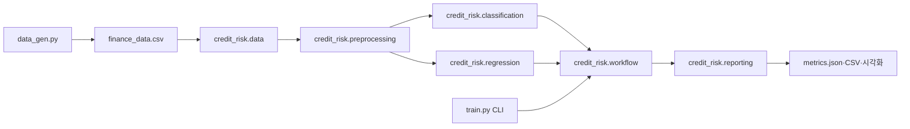

# 신용 위험 모델링 파이프라인

## 프로젝트 소개

10,000건의 가상 금융 데이터를 직접 생성하고, 규칙 기반 베이스라인과 머신러닝 모델을 정량적으로 비교하는 지도학습 프로젝트입니다. 동일한 여섯 고객 특성으로 연체 위험을 분류하고 신용 점수를 회귀 예측하며, 데이터 누수 방지·불균형 처리·L1/L2 규제·앙상블 튜닝의 효과를 재현 가능한 실행 흐름으로 확인합니다.

## 핵심 특징

- 여섯 조건의 규칙 기반 모델과 Logistic Regression, Random Forest 비교
- `class_weight="balanced"`를 이용한 불균형 학습과 5-fold 교차검증
- GridSearchCV로 12개 Random Forest 조합 최적화
- Ridge/Lasso의 다섯 Alpha별 계수 변화와 RMSE·MAE·R² 비교
- Confusion Matrix, ROC Curve, Feature Importance, 규제 계수 경로 생성
- 8:2 Train/Test 분할, `random_state=42`, Pipeline 기반 누수 방지

## 아키텍처



`credit_risk` 패키지는 데이터 로드·분할, 공통 전처리, 분류와 회귀 학습, 결과 저장을 책임별 모듈로 분리합니다. 계산 함수인 `train_classification()`과 `train_regression()`은 파일을 생성하지 않아 독립적으로 재사용할 수 있고, `workflow`가 계산과 `reporting`을 연결합니다. 루트 `train.py`는 기존 실행 방법과 import 호환성을 유지하는 CLI 진입점입니다.

## 빠른 시작

Python 3.10 이상이 필요합니다.

`uv`를 사용하는 경우:

```bash
uv sync
uv run python data_gen.py
uv run python train.py
uv run python -m pytest -v
```

`pip`을 사용하는 경우:

```bash
python3 -m venv .venv
source .venv/bin/activate
pip install -r requirements.txt
python data_gen.py
python train.py
```

테스트는 다음 명령으로 실행합니다.

```bash
python -m pytest -v
```

`requirements.txt`와 `pyproject.toml`에는 프로젝트가 직접 사용하는 라이브러리만 명시합니다. 재현 가능한 전이 의존성 버전은 `uv.lock`에서 관리합니다.

`finance_data.csv`와 예측 CSV는 `.gitignore`의 `*.csv` 규칙으로 저장소에서 제외됩니다. 전체 실행 결과는 `artifacts/`에 생성됩니다.

## 데이터와 분할

입력 특성은 `age`, `annual_income`, `spending_score`, `debt_ratio`, `credit_card_count`, `overdue_count_6m`입니다. 제공된 생성 코드의 수식과 노이즈를 변경하지 않았습니다.

| 데이터 | 정상(0) | 연체(1) | 양성 비율 |
|---|---:|---:|---:|
| 전체 | 8,799 | 1,201 | 12.01% |
| Train | 7,039 | 961 | 12.01% |
| Test | 1,760 | 240 | 12.00% |

분류는 `test_size=0.2`, `stratify=y`, `random_state=42`로 분할하여 Train/Test의 연체 비율을 보존했습니다. 회귀도 동일한 8:2 비율과 시드를 사용합니다.

## 분류 성능

| 모델 | Accuracy | Precision | Recall | F1-Score | ROC-AUC | 예측 지연시간(ms) |
|---|---:|---:|---:|---:|---:|---:|
| 규칙 기반 | 0.7725 | 0.3285 | 0.8583 | 0.4752 | 0.8096 | 13.5275 |
| Logistic Regression | 0.8785 | 0.4965 | **0.8750** | **0.6335** | **0.9505** | **1.7027** |
| Random Forest | **0.9095** | **0.6528** | 0.5250 | 0.5820 | 0.9376 | 36.8787 |
| Random Forest (튜닝) | 0.8840 | 0.5102 | 0.8333 | 0.6329 | 0.9409 | 59.7413 |

Logistic Regression은 규칙 기반보다 F1-Score가 약 33.3%, ROC-AUC가 약 17.4% 향상되었습니다. Accuracy만 보면 기본 Random Forest가 가장 높지만 연체 Recall이 0.5250으로 낮아, 연체 고객을 정상으로 놓치는 비용이 큰 신용 심사에는 부적합합니다.

튜닝된 Random Forest의 최적값은 `max_depth=8`, `min_samples_split=5`, `n_estimators=200`이며 Train 내부 CV F1은 0.6662입니다. 튜닝 후 기본 Forest 대비 F1은 0.5820에서 0.6329로 약 8.8%, Recall은 0.5250에서 0.8333으로 상승했습니다. 대신 오탐 증가로 Accuracy와 Precision은 낮아졌습니다.


### 평가지표 선정 근거

전체 양성 비율이 12.01%이므로 Accuracy는 다수 클래스의 영향을 크게 받습니다. 따라서 Accuracy를 단독으로 사용하지 않고, 양성 클래스의 Precision과 Recall을 함께 반영하는 F1-Score와 임계값 전반의 순위 구분 능력을 나타내는 ROC-AUC를 핵심 지표로 사용했습니다.

규칙 기반 모델은 여섯 `if` 조건의 최종 0/1 판단만 반환합니다. 이 값으로 AUC 계산은 가능하지만 ROC가 하나의 거친 운영점에 기반하므로, `predict_proba()`가 반환한 연속 위험 확률로 계산한 ML 모델의 AUC와 동일한 수준으로 해석하면 안 됩니다.

### 규칙 기반 베이스라인

다음 조건 중 하나라도 만족하면 연체 위험으로 분류합니다.

1. 최근 6개월 연체가 2회 이상
2. 부채 비율이 80% 초과이고 연 소득이 4,500만원 미만
3. 연 소득이 2,500만원 미만
4. 소비 점수가 90 초과이고 부채 비율이 70% 초과
5. 카드가 8개 이상이고 부채 비율이 65% 초과
6. 25세 미만이고 부채 비율이 75% 초과

규칙은 설명과 변경이 쉽지만 경계가 불연속적이고 특성 간 복잡한 결합을 학습하지 못합니다. ML은 데이터에서 가중치와 상호작용을 학습해 F1/AUC를 높였지만, 데이터 품질과 분포 변화에 의존하고 정기적인 검증이 필요합니다.

### 불균형 처리

SMOTE 대신 Logistic Regression과 Random Forest에 `class_weight="balanced"`를 사용했습니다. 데이터 자체를 합성하지 않고 학습 손실에서 소수 클래스의 중요도를 높이며 Pipeline을 단순하게 유지할 수 있기 때문입니다.

| 방법 | 장점 | 한계 |
|---|---|---|
| Class weight | 합성 샘플 없이 비용 민감 학습, Pipeline이 단순함 | 모델이 가중치 기능을 지원해야 하며 확률 보정이 달라질 수 있음 |
| SMOTE | 소수 클래스의 학습 표본을 직접 보강 | 부적절한 합성점·노이즈 증폭 가능, CV 내부 리샘플링 구성이 필요함 |

`class_weight`는 학습 과정의 손실 계산에만 영향을 주며 Test Set 자체의 분포는 변경하지 않습니다. SMOTE를 사용하더라도 Train/CV fold 내부에서만 적용해야 하며, Test Set은 실제 분포를 보존해야 공정한 일반화 성능을 평가할 수 있습니다.

### 앙상블과 편향·분산

Random Forest는 여러 결정트리의 예측을 평균하여 단일 트리의 높은 분산을 낮춥니다. 이번 실험에서도 깊이를 제한한 튜닝 모델이 기본 Forest보다 Recall과 F1을 높여 과도하게 세분화된 경계를 완화했습니다. 다만 데이터 생성 신호가 소득·부채·연체 횟수의 선형 관계에 가까워 Logistic Regression이 튜닝 Forest보다 F1, AUC, 지연시간 모두 우수했습니다. 앙상블이 항상 선형 모델보다 낫지는 않으며 데이터의 구조와 운영 비용을 함께 봐야 합니다.

### Feature Importance 해석


- 연 소득의 중요도가 50.9%로 가장 높아 분류 경계 형성에 가장 많이 사용되었습니다.
- 최근 연체 횟수 24.5%, 부채 비율 16.2%가 뒤를 이어 데이터 생성 규칙과 일관된 결과를 보였습니다.
- 수치형 카드 수의 중요도는 1.7%로 예측 기여가 제한적이었습니다.
- 중요도는 영향의 방향이나 인과관계를 의미하지 않으며, 분할 기반 중요도에는 편향이 있을 수 있습니다.

## 회귀 성능

Alpha 선택은 Train Set 내부 5-fold CV 평균 RMSE만으로 수행했습니다. 선택된 모델을 전체 Train Set에 다시 학습한 뒤 Test Set은 최종 평가에 한 번만 사용했습니다.

| 모델 | 선택 Alpha | Test RMSE | Test MAE | Test R² |
|---|---:|---:|---:|---:|
| Ridge | 1.0 | 29.3667 | 23.2739 | 0.8607 |
| Lasso | 0.1 | **29.3599** | **23.2711** | **0.8607** |

두 모델 모두 약 86%의 신용점수 분산을 설명했으며 Lasso가 근소하게 우수했습니다. 지표는 clipping 전 원시 예측값으로 계산하여 범위 밖 오차를 숨기지 않았고, 사용자에게 제공하는 `credit_score_predictions.csv`의 예측값만 0~1000으로 제한했습니다.


그래프의 계수는 원래 단위가 아니라 전처리 후 표준화 공간 기준입니다. Ridge의 L2 규제는 계수를 연속적으로 축소하면서 대부분 남기는 반면, Lasso의 L1 규제는 Alpha가 커질수록 중요도가 낮은 계수를 정확히 0으로 만들어 변수 선택 효과를 냅니다. 실제로 Lasso Alpha 1에서는 카드 수를 포함한 영향이 작은 특성의 계수가 0이 되었고, Alpha 100에서는 모든 계수가 0으로 수축해 CV RMSE가 80.25까지 악화되었습니다.

## 데이터 누수 방지

- `credit_score`는 `is_overdue` 생성에 직접 사용되므로 분류 입력에서 제외했습니다. 두 타깃 모두 여섯 입력 특성에 포함하지 않았습니다.
- 여섯 수치형 특성의 중앙값 대치와 Standard Scaling을 `ColumnTransformer`와 모델 `Pipeline` 안에 배치했습니다.
- 전처리기는 각 Train/CV fold에서만 fit되고 Test Set에는 transform만 수행합니다.
- Random Forest GridSearchCV와 Ridge/Lasso Alpha 선택은 Train 내부 5-fold 결과만 사용합니다.
- Test Set은 하이퍼파라미터 선택이 끝난 모델의 일반화 성능 산출에만 사용합니다.

원 데이터에는 명시적 범주형 열이 없습니다. `credit_card_count`와 `overdue_count_6m`은 정수로 표현된 횟수형 특성이므로, 값의 순서와 크기 정보를 보존하도록 다른 네 특성과 함께 수치형으로 처리했습니다.

## 운영 모델과 임계값

최종 운영 후보로 Logistic Regression을 선택합니다. 튜닝 Forest보다 F1이 0.0006, AUC가 0.0095 높고 이번 환경에서 예측 지연시간도 훨씬 짧았습니다. 지연시간은 실행 환경에 따라 달라질 수 있지만, 현재는 앙상블의 복잡도와 응답 비용을 정당화할 성능 향상이 없습니다.

연체 고객을 정상으로 판단하는 미탐은 원금·이자 손실로 이어질 수 있어 Recall/F1을 우선했습니다. 반대로 정상 고객을 연체로 판단하는 오탐은 승인 기회와 고객 신뢰를 잃게 합니다. 기본 임계값은 0.5이며, 미탐 비용이 더 크면 임계값을 낮춰 Recall을 높이고, 오탐 비용이나 심사 인력 부담이 더 크면 임계값을 높여 Precision을 높일 수 있습니다. 실제 운영에서는 두 오류의 금액 비용을 정의한 후 검증 데이터에서 기대 비용이 최소인 임계값을 선택해야 합니다.

## 산출물

| 파일 | 역할 |
|---|---|
| `data_gen.py` | 제공된 규칙으로 10,000건 데이터 생성 |
| `train.py` | 기존 API를 제공하고 전체 분석을 실행하는 CLI 진입점 |
| `credit_risk/data.py` | 데이터 스키마, 로드·검증, Train/Test 분할 |
| `credit_risk/preprocessing.py` | 여섯 수치형 특성의 공통 전처리 Pipeline 생성 |
| `credit_risk/classification.py` | 규칙·Logistic·Random Forest 학습 및 평가 |
| `credit_risk/regression.py` | Ridge·Lasso 선택, 학습 및 평가 |
| `credit_risk/reporting.py` | 그래프와 CSV·JSON 산출물 저장 |
| `credit_risk/workflow.py` | 분류·회귀 계산과 리포팅 실행 흐름 조립 |
| `tests/test_data_gen.py` | 데이터 크기·범위·재현성 검증 |
| `tests/test_train.py` | 누수 방지, 규칙, 분류·회귀·산출물 검증 |
| `artifacts/metrics.json` | 클래스 분포, CV, Test 성능, 계수·중요도 기록 |
| `artifacts/confusion_matrix.png` | Logistic/튜닝 Forest 오분류 비교 |
| `artifacts/roc_curve.png` | 규칙·ML 모델 ROC-AUC 비교 |
| `artifacts/feature_importance.png` | 튜닝 Forest 특성 중요도 |
| `artifacts/regularization_coefficients.png` | Ridge/Lasso Alpha별 계수 변화 |

## 한계

- 가상 데이터의 생성 규칙을 학습한 결과이므로 실제 고객의 신용 심사에 사용할 수 없습니다.
- 공정성, 설명 가능성, 확률 보정, 시간에 따른 데이터 드리프트는 이 미션 범위에 포함하지 않았습니다.
- 모델 지연시간은 현재 장비의 2,000건 Test Set 배치 예측 기준이며 온라인 단건 지연시간과 다릅니다.
